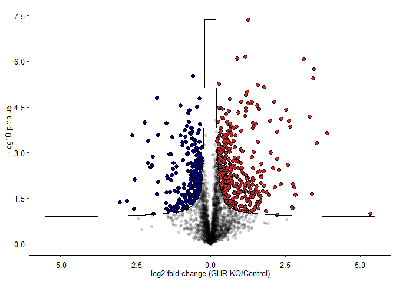
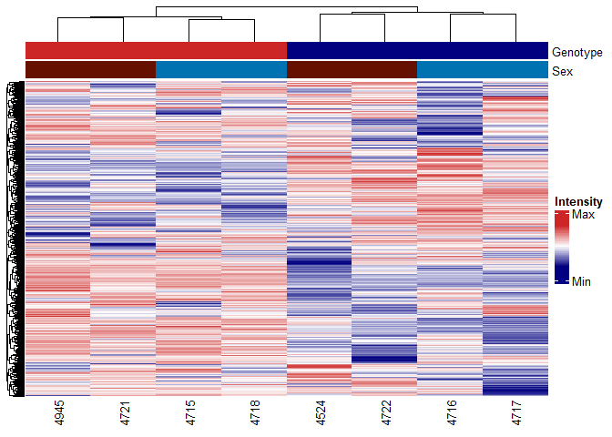
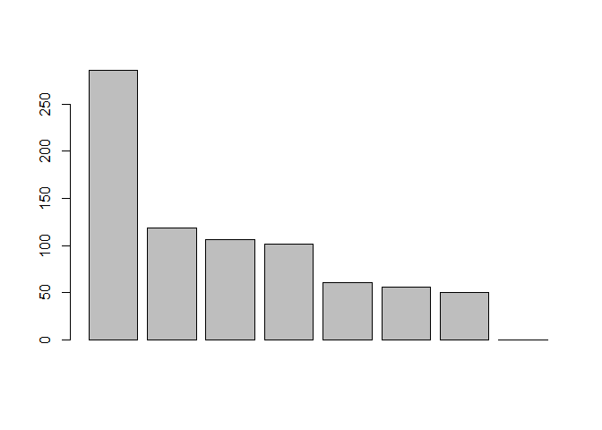
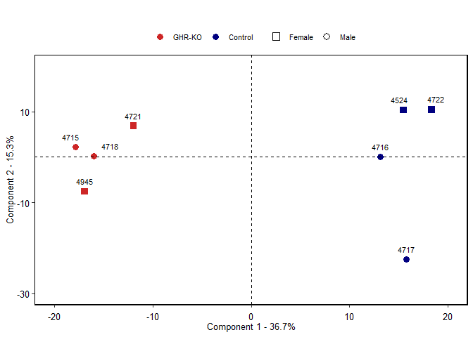
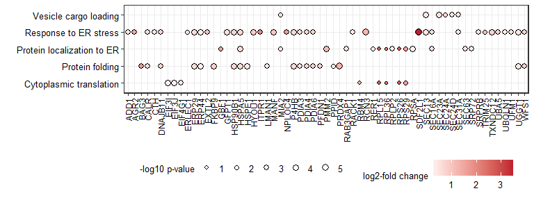
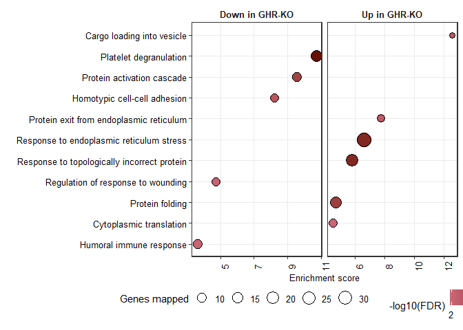
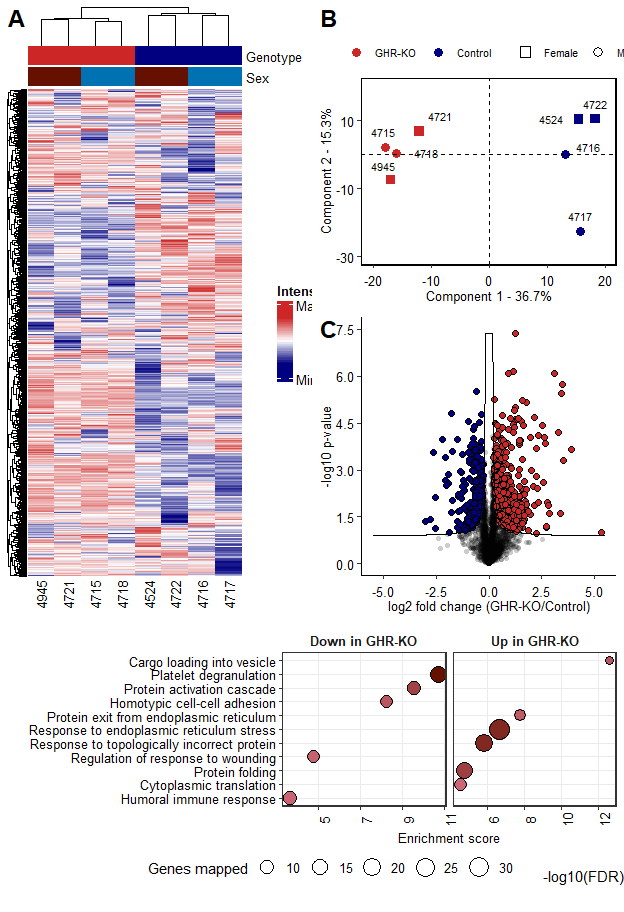

GRH-KO Pituitary gland
================
BS
07/08/2022

## Load libraries

``` r
library     (tidyverse)
library     (ComplexHeatmap)
library     (cowplot)
library     (ggrepel)
library     (ggpubr)
```

## read data

``` r
perseus_output <- read.delim("input files/perseus_output.txt",check.names = F)
volcano_curve <- read.delim("input files/volcano_curve.txt")
conditions <- read.delim("input files/conditions.txt")
buble_plot <- read.delim("input files/bubble_plot.txt")
ORA_data <- read.delim("input files/ORA_plot.txt")
```

## clean-up the curve

``` r
maxl2fc <- ceiling(max(perseus_output$l2fc))
minl2fc <- floor(min(perseus_output$l2fc))

if(maxl2fc > abs(minl2fc)) {
z <- maxl2fc} else 
  {z <- minl2fc}

volcano_curve <- volcano_curve %>% 
  filter(x > 0 & x < abs(z) | x < 0 & x > -abs(z))
```

## plot volcano

``` r
#define diff abundant proteins
perseus_output$diff_abundant <- NA
perseus_output$diff_abundant[perseus_output$Significant == "+" & perseus_output$l2fc > 0] <- "Upregulated"
perseus_output$diff_abundant[perseus_output$Significant == "+" & perseus_output$l2fc < 0] <- "Downregulated"
perseus_output$diff_abundant[perseus_output$Significant != "+" ] <- "n.s."

# number of differentially abundant proteins
lengt_up <- sum(str_count(perseus_output, "Upregulated"))
```

    ## Warning in stri_count_regex(string, pattern, opts_regex = opts(pattern)):
    ## argument is not an atomic vector; coercing

``` r
lengt_down <- sum(str_count(perseus_output, "Downregulated"))
```

    ## Warning in stri_count_regex(string, pattern, opts_regex = opts(pattern)):
    ## argument is not an atomic vector; coercing

``` r
# plot
volcano.plot <- ggplot(perseus_output %>%                               
mutate(diff_abundant = replace(diff_abundant, diff_abundant == "n.s.", "AA"))%>%
arrange(diff_abundant), mapping = aes(x = l2fc, y = `-LOG10 p-value`, fill=diff_abundant, alpha = diff_abundant))+
geom_point(aes(shape =diff_abundant, size = diff_abundant), stroke = 0.15)+
scale_fill_manual(values= c("AA" = "#4a4949", "Downregulated"= "navy", "Upregulated"= "firebrick3"))+
scale_shape_manual(values= c("AA" = 16, "Downregulated"= 21, "Upregulated"= 21))+
scale_size_manual(values= c("AA" = 1.6, "Downregulated"= 2.2, "Upregulated"= 2.2))+
geom_path(data = volcano_curve, mapping = aes(x ,y),size =0.5 ,inherit.aes = FALSE, na.rm = TRUE, color = "black")+
scale_alpha_manual(values= c("AA" = 0.2, "Downregulated"= 1, "Upregulated"= 1))+
theme(panel.grid.major = element_blank(), panel.grid.minor = element_blank(), panel.background = element_blank(), axis.line = element_line(),
legend.position = "NONE")+
theme(axis.title = element_text(size = 10), axis.text.x = element_text(size=10, colour = "black", vjust = -0.1), axis.text.y = element_text(size = 10, colour = "black"))+
scale_x_continuous(breaks = c(-5, -2.5, 0, 2.5,5), limits = c(-5.5,5.5))+   
scale_y_continuous(limits = c(0,7.5), breaks = c(0,1.5,3,4.5,6,7.5))+
xlab("log2 fold change (GHR-KO/Control)")+
ylab("-log10 p-value")
#annotate("text", x = 5, y = 7, size = 4, label = paste("↑", lengt_up))+
#annotate("text", x = -5, y = 7, size = 4, label = paste("↓", lengt_down))
ggsave("output files/volcano.svg", width=3.2, height=3.2)
plot(volcano.plot)
```

<!-- -->

## dataframe for PCA and Heatmap

``` r
data_clustering <- perseus_output[c(27:34)]
```

## hierarchical clustering

``` r
# assign colours
colours <- list('Genotype' = c('GHR-KO' = "firebrick3", 'Control' = "navy"),
                'Sex' = c('Female' = "#661100", 'Male' = "#0072B2"))


# column annotation
colAnn <- HeatmapAnnotation(df = column_to_rownames(conditions, "Animal"),
                            which = 'col',
                            show_legend = F, 
                            annotation_name_gp= gpar(fontsize = 10),
                            annotation_name_side = "right",
                            col = colours,
                            annotation_height =  unit(c(0.1), 'cm'))
                         
# data standardization (by rows)
standardization_function <- function(x){(x - mean(x)) / sd(x)}
data_clustering_norm <- t(apply(data_clustering, 1, standardization_function))


# plotting
heatmap.plot <- Heatmap(data_clustering_norm,
                heatmap_legend_param = list(
                title = "Intensity", at = c(-4, 4), 
                labels = c("Min", "Max")),
                column_names_gp = grid::gpar(fontsize = 10),
                row_dend_width = unit(0.5, "cm"),
                show_heatmap_legend = T,
                col = colorRampPalette(c("navy", 
                                         "white", "firebrick3"))(50),
                top_annotation=colAnn)

ht = draw(heatmap.plot, merge_legend = TRUE)
```

<!-- -->

``` r
w = (ComplexHeatmap:::width(ht))/25.4
h = (ComplexHeatmap:::height(ht))/25.4

# save
svg("output files/heatmap.svg", width = 3.2, height = 6.4) # save as svg
ht = draw(heatmap.plot, merge_legend = TRUE)
heatmap_gb = grid.grabExpr(draw(heatmap.plot))       # will be used for cowplot
```

## principal component analysis

``` r
# caclulate principal components of transposed dataframe
PCA <- prcomp(t(data_clustering))

# export results for ggplot
# according to https://www.youtube.com/watch?v=0Jp4gsfOLMs (StatQuest: PCA in R)
pca.data <- data.frame(Animal=rownames(PCA$x),
X=PCA$x[,1],
Y=PCA$x[,2])
pca.var <- PCA$sdev^2
pca.var.per <- round(pca.var/sum(pca.var)*100,1)

# plot principal components
barplot(pca.var)
```

<!-- -->

``` r
# change class to match properly
conditions$Animal <- as.character(conditions$Animal)

# assign conditions
pca.data <- pca.data %>% 
  left_join(conditions)
```

    ## Joining, by = "Animal"

## define length of x and y coordinates

``` r
roundUp <- function(x,to=10)
{
  to*(x%/%to + as.logical(x%%to))
}

length.yPCApos   <-   roundUp(max(pca.data$Y))
length.yPCAneg   <- -(roundUp(abs(min(pca.data$Y))))

length.xPCApos   <-   roundUp(max(pca.data$X))
length.xPCAneg   <- -(roundUp(abs(min(pca.data$X))))
```

## plot PCA

``` r
pca.plot <- ggplot(data=pca.data, aes(x=X, y=Y, label=Animal, color= Genotype, shape = Sex))+geom_point(size = 3)+
scale_color_manual(values= c('GHR-KO' = "firebrick3", 'Control' = "navy"))+
scale_shape_manual(values= c('Female' = 15, 'Male' = 16))+
geom_text_repel(min.segment.length = Inf, seed = 42, box.padding = 0.5, nudge_y = 1, colour="black", size = 3)+
xlab(paste("Component 1 - ", pca.var.per[1], "%", sep=""))+
ylab(paste("Component 2 - ", pca.var.per[2], "%", sep=""))+
scale_x_continuous(breaks = c(seq(length.xPCAneg, length.xPCApos,10)), limits = c(length.xPCAneg, length.xPCApos))+ scale_y_continuous(limits = c(length.yPCAneg, length.yPCApos), breaks = c(seq(length.yPCAneg, length.yPCApos,20)))+
geom_hline(yintercept = 0, linetype = "dashed")+
geom_vline(xintercept = 0, linetype = "dashed")+
theme_bw() + theme(panel.border = element_rect(size = 1, colour = "black"), axis.title = element_text(size = 10, colour="black"), axis.text.x = element_text(size=10, colour="black", vjust = -0.1), axis.text.y = element_text(size = 10, colour="black"),
panel.grid.major = element_blank(), panel.grid.minor = element_blank())+
theme(legend.title = element_text(colour="black", size=10))+
guides(shape = guide_legend(order = 2, override.aes = list(stroke = 1, shape  = c(0,1))),
       col = guide_legend(order = 1))+
theme(legend.text = element_text(colour="black", size=8), legend.title = element_blank(), legend.margin=margin(t=25), legend.position = "top")
ggsave("output files/pca.svg", width = 3.2, height = 3.2)
plot(pca.plot)
```

<!-- -->

## dot plot (figure 4)

``` r
data <- buble_plot %>% 
  left_join(perseus_output) %>% 
  select(1:5) 
```

    ## Joining, by = "Gene"

``` r
dot.plot <- ggplot(data, aes(x = Gene, y= Process, fill = l2fc, size = `-LOG10 p-value`)) +
 geom_point(shape=21)+
 theme_bw() +
 theme(panel.border = element_rect(size = 1),
                            axis.text.x = element_text(angle = 90, colour = "black", size = 9, vjust = 0.5, hjust = 1),
                            axis.title = element_text(size= 9.5),
                            axis.text.y = element_text(size = 9.5, colour = "black"))+
                      xlab("")+
                      ylab("")+
                      theme(plot.title = element_blank()) +

                      theme(panel.grid.major = element_line(), panel.grid.minor = element_blank())+
                      scale_size_continuous(name = "-log10 p-value", range = c(1.5, 3.2))+
                      scale_fill_gradient2(name = "log2-fold change", low = "#203564", mid = "white", high = "#be1e2d")+
                 theme(legend.position = "bottom", legend.box.spacing = unit(0.5, 'mm'), legend.title = element_text(size =9.5), legend.text = element_text(size = 9.5))+
                      theme(strip.background = element_blank(), strip.text = element_text(size = 9.5, face = "bold"))
ggsave("output files/dot.svg", height = 3, width = 8)
plot(dot.plot)
```

<!-- -->

## ORA dot plot

``` r
ORA_data <- ORA_data %>%
  mutate(logsig = -log10(FDR))
 
# order rows based on enrichment score for SKM
ORA_data$description<- factor(ORA_data$description, levels = ORA_data$description
                             [order(ORA_data$enrichmentRatio)])

# plot
ora.plot <- ggplot(ORA_data, aes(x = enrichmentRatio, y= description, fill = logsig, size = overlap), fill = NULL) +
 geom_point(shape = 21)+
 theme_bw() +
 theme(panel.border = element_rect(size = 1),
                            axis.text.x = element_text(angle = 90, colour = "black", size = 9.5),
                            axis.title = element_text(size= 9.5),
                            axis.text.y = element_text(size = 9.5, colour = "black"))+
                      xlab("Enrichment score")+
                      ylab("")+
                      theme(plot.title = element_text(size = 9.5, hjust=0.5,
                                                      face = "bold")) +
                      theme(panel.grid.major = element_line(), panel.grid.minor = element_blank())+
                      scale_size_continuous(name = "Genes mapped", range = c(3, 7))+
                      scale_fill_gradient(name = "-log10(FDR)", low = "#CC6677", high = "#661100")+
                      theme(legend.position = "bottom", legend.box.spacing = unit(0.5, 'mm'), legend.text = element_text(size = 9.5))+
                      facet_grid(~regulation, scales = "free")+
    theme(strip.background = element_blank(), strip.text = element_text(size = 9.5, face = "bold"))
ggsave("output files/ora.svg", height = 6, width = 8)
plot(ora.plot)
```

<!-- -->

## combine figures

``` r
plot_1 <- ggarrange(pca.plot, volcano.plot, labels = c("B", "C"), font.label = list(size = 18),
          ncol = 1, nrow = 2)


plot_2 <- plot_grid(heatmap_gb, plot_1 , rel_widths = c(3.2, 3.2), rel_heights = c(6.4,6.4), labels = c('A'), label_size = 18)


plot_3 <- plot_grid(plot_2, ora.plot, nrow = 2, rel_widths = c(6.4, 6.4), rel_heights = c(6.4,3))
ggsave("output files/combined.svg", width = 6.4, height = 9.4)
plot(plot_3)
```

<!-- -->
